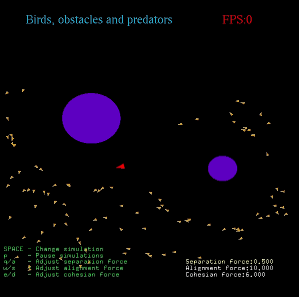

# Boids

A C++ implementation of Boids. Boids is an artificial life program, developed by Craig Reynolds in 1986, which simulates the flocking behavior of birds. For information about the implementation see [Reynolds web article](http://www.red3d.com/cwr/boids/) and also [Wikipedia: Boids](https://en.wikipedia.org/wiki/Boids).

The simulation has 4 modes:
- Birds
- Birds and obstacles
- Birds and predators
- Birds, predators and obstacles

Demonstration:

<p float="center">
  
</p>

### Build and run
```bash
cd src
g++ Main.cpp Boid.cpp PosVec.cpp -o ../app -lglut -lGLU -lGL
./app
```